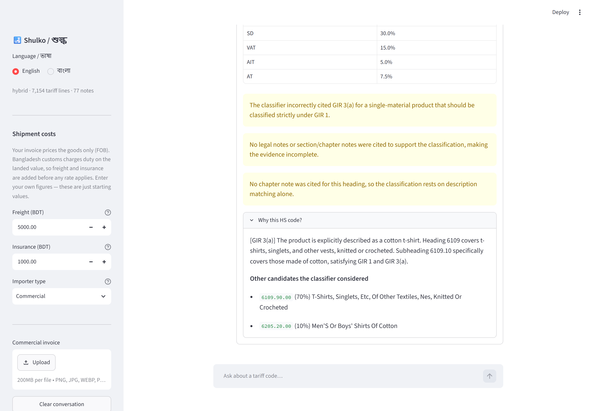

# Shulko (শুল্ক) — Bangladesh Import Landed-Cost Agent

Turns a photographed commercial invoice into an auditable landed-cost sheet:
every taka traced back to a tariff heading and a customs note.



---

## The problem

An SME importer in Dhaka does not know the duty payable until the goods
reach the port. Getting it wrong is expensive in both directions: under-declare
and the consignment is held and penalised, over-declare and working capital is
tied up in tax that was never owed.

Getting it right requires three things at once:

1. **An 8-digit HS code** drawn from a 1,000-page tariff schedule whose
   headings are written in legal English, not trade English. "Plastic bag"
   is nowhere in the book; "articles for the conveyance or packing of
   goods" is.
2. **The Section and Chapter Notes**, which override what a heading appears
   to say. A heading can look like a perfect match and still be excluded by
   a note two pages earlier.
3. **What changed since the book was printed.** NBR issues SROs that alter
   rates, ban goods, or make a certificate mandatory, and the printed
   schedule does not know about them.

A customs broker does this from memory and charges for it. Shulko does the
first pass, shows its working, and says plainly when it is unsure.

**Target user:** a small or medium importer, or the junior staffer at a
clearing agent who prepares the first draft of a bill of entry.

### Why AI, specifically

The lookup is not the hard part — a database can do that. The hard part is
mapping loose commercial language onto legal categories, and then applying
exclusion notes that contradict the obvious reading. That is a judgement
task over text, which is what a language model is for.

The arithmetic is not. So the model never does it — see below.

---

## How it works

```
                 ┌─ invoice ──→ Extract ─┐
User input ─→ Route ─ duty question ─────┼─→ Classify ─→ Duty ─→ Regulatory ─→ Verify ─→ Report
                 └─ out of scope ────────────────────────────────────────────────────────┘
```

| Stage | What it does | What it is |
|---|---|---|
| **Route** | invoice / duty question / out of scope | rules first, LLM only when ambiguous |
| **Extract** | invoice image or PDF → typed line items | Gemini vision OCR + PyMuPDF + RapidOCR |
| **Classify** | line item → top 3 HS codes with citations | 3-stage: hybrid retrieval → shortlist → rank against the notes |
| **Duty** | HS code → full tax cascade | **plain Python, no LLM**, unit tested |
| **Regulatory** | live SRO / ban / certificate check | Gemini native Google Search grounding |
| **Verify** | adversarial review of the classification | separate judge model, can force human review |
| **Report** | itemised landed cost + advisories | Streamlit |

### The one design rule

**The LLM decides which tariff heading applies. It never computes a number.**

Classification is a judgement, so a model makes it. Duty is arithmetic, so
Python makes it — in `backend/core/duty.py`, with no model anywhere in the
file and a unit test against a worked example. Every figure the user sees can
be recomputed by hand from the rates shown next to it.

### Why a fixed graph and not a ReAct agent

The steps needed to classify an invoice are known in advance, so there is
nothing for a planner to discover at runtime. arXiv 2603.07379 catalogues
what free-roaming retrieval loops buy instead: compounding hallucination,
memory poisoning, retrieval misalignment, cascading tool failure. The
judgement lives inside the nodes; the control flow does not need to be
improvised.

### Why three HS codes and not one

The error analysis in arXiv 2605.14857 found **65% of its classification
mistakes were ranking errors on candidates that had been retrieved** — the
right answer was in the list, just not first. Showing the top three surfaces
the correct code far more often than showing one, and the spread between
them is itself the honest signal of how sure the system is. When the top two
are within 10 points, the run is flagged for review even if the verifier is
satisfied.

---

## Setup

```bash
git clone https://github.com/TabassumNadia/shulko.git
cd shulko
python -m venv .venv
source .venv/bin/activate        # Windows: .venv\Scripts\activate
pip install -r requirements.txt
cp .env.example .env             # then fill in GOOGLE_API_KEY and LANGSMITH_API_KEY
```

Two keys are needed, both free:

| Key | Where | Used for |
|---|---|---|
| `GOOGLE_API_KEY` | [aistudio.google.com/apikey](https://aistudio.google.com/apikey) | vision OCR, classification, Google Search grounding |
| `LANGSMITH_API_KEY` | [smith.langchain.com](https://smith.langchain.com/settings) → API Keys | tracing |

`TAVILY_API_KEY` is optional but worth setting before a demo — see
[Quota](#quota-the-thing-that-actually-breaks) below.

### Build the index

The repository ships the parsed schedule (`data/processed/`) but not the
vector store, which is machine-local. Build it once:

```bash
python -m backend.rag.ingest index
```

That embeds 7,154 tariff lines and 77 chapter notes locally with FastEmbed
(~90 MB ONNX model on first run, no API quota). Takes a few minutes; it
resumes if interrupted.

To rebuild the parsed schedule from the source PDFs instead:

```bash
python -m backend.rag.ingest rates data/raw/Tariff-2025-2026\(29-07-2025\).pdf
python -m backend.rag.ingest notes data/raw/Chapter_*.pdf
```

### Run

Two processes, in two terminals:

```bash
uvicorn backend.main:app --reload
```

```bash
streamlit run frontend/app.py
```

Then open <http://localhost:8501>. Check <http://localhost:8000/health>
first — it reports what is actually configured and indexed:

```json
{
  "status": "ok",
  "tariff_chapters_loaded": 96,
  "indexed": { "tariff_lines": 7154, "chapter_notes": 77 },
  "retrieval_mode": "hybrid",
  "langsmith_tracing": true
}
```

`"retrieval_mode": "bm25_only"` means the vector store is missing or
unreachable and retrieval has silently degraded to lexical search — run the
index step above.

### Verify

```bash
pytest                       # 72 tests, no network, no API key needed
python -m backend.core.llm   # lists the models your key can actually reach
```

---

## Quota: the thing that actually breaks

The Gemini free tier allows **5 `generateContent` requests per minute, per
model**. One invoice needs a vision call, two classification calls per line
item, a verification call per item and a grounded search — well past five —
and line items are processed concurrently, so they arrive as a burst.

Unthrottled, the run dies partway through with a 429 and the user loses the
whole analysis. This was the single most common failure in development, so
it is handled in three layers:

1. **A token bucket per model id** (`backend/core/llm.py`). Keyed by model
   because that is how Google meters it — the 429 names the model. Roles
   sharing a model share one bucket; roles on different models do not queue
   behind each other. The direct google-genai grounding call draws from the
   same bucket rather than spending quota invisibly.
2. **Retry on rate-limit errors only**, waiting the `retryDelay` the API
   itself returns. A bad prompt or a dead model id fails on the first
   attempt instead of burning quota to reach the same error.
3. **Contained failure.** If an item still fails, that item is flagged
   `needs_review` with the reason and every other item keeps its numbers.
   A failed verification flags for review — it never quietly passes.

Set `GEMINI_RPM` in `.env` to match your tier. On a paid key, raise it and
the whole pipeline gets faster with no code change.

**Grounded search has a separate, smaller free-tier allowance** and is
usually the first thing to run out. When it does, the run still completes
and simply carries no advisories. Setting `TAVILY_API_KEY` (free, 1,000
searches/month) gives the Regulatory agent a fallback that retrieves pages
and answers strictly from them.

---

## Project structure

```
backend/
  main.py              FastAPI: /health /ask /analyze /runs
  core/
    config.py          all settings, .env only, never a literal key
    llm.py             model factory, rate limiting, retry
    duty.py            the tax cascade — no LLM in this file
    schemas.py         pydantic types shared across agents
    i18n.py            English / Bangla UI strings
  graph/
    builder.py         the LangGraph state machine
    router.py          invoice / duty question / out of scope
    state.py           the dict that travels between nodes
  agents/
    extractor.py       invoice → typed line items
    classifier.py      3-stage HS classification
    regulatory.py      grounded SRO and restriction check
    verifier.py        adversarial review
  tools/
    ocr_tool.py        PyMuPDF / RapidOCR / vision
    grounded_search.py Gemini google_search, Tavily fallback
    tariff_tool.py     exact HS code → rates, raises if absent
  rag/
    ingest.py          PDF → tariff.csv + notes.jsonl → Chroma
    store.py           Chroma collections, chunking, embeddings
    retriever.py       BM25 + dense, fused with RRF
  prompts/             one module per agent, no prompt inline in code
  db/                  SQLModel run history
frontend/app.py        Streamlit chat UI
data/
  raw/                 source tariff PDFs
  processed/           tariff.csv (7,154 rows), notes.jsonl (77 notes)
  samples/             three test invoices
tests/                 72 tests
docs/                  architecture and screenshots
```

---

## RAG and the vector database

**What is stored.** Two Chroma collections:

| Collection | Documents | Chunking | Why |
|---|---|---|---|
| `tariff_lines` | 7,154 | one HS row = one chunk | a row is already the smallest meaningful unit; splitting one would separate a rate from its description |
| `chapter_notes` | 77 | one note = one chunk, never split | notes are self-contained legal sentences the classifier must quote verbatim |

Rates ride in **metadata**, not in the embedded text: `15` and `5` carry no
semantic signal and including them only blurs the vector.

**Embeddings.** FastEmbed `BAAI/bge-small-en-v1.5` (384-dim, local ONNX) by
default. This is a deliberate architectural call, not a cost saving: bulk
embedding 7,154 static rows through the Gemini API would exhaust the same
100-requests-per-minute budget the agents need to reason with. Work that
never changes and requires no intelligence should not compete for the
intelligent budget. `EMBEDDING_PROVIDER=google` switches it.

Collections are namespaced by provider (`tariff_lines__fastembed`) because
Chroma fixes vector dimensionality at creation — switching providers builds
a fresh collection instead of failing halfway with a dimension mismatch.

**Retrieval.** LangChain `EnsembleRetriever` fuses BM25 with Chroma dense
search by Reciprocal Rank Fusion, weighted 0.6/0.4 toward lexical. Both are
needed: BM25 nails `polypropylene` and `3901`, the dense side catches
"plastic bag for packing goods" when the schedule says "articles for the
conveyance or packing of goods". RRF is used rather than score averaging
because BM25 scores and cosine similarities are on different scales and are
not comparable — RRF uses only each engine's rank, so no normalisation is
needed.

This stage optimises **recall**, not precision (22% of the reference paper's
errors were candidates never retrieved at all). The two LLM stages after it
do the narrowing.

**How retrieval reaches the LLM.** Stage 1 returns 30 candidates. Stage 2
narrows to 8 on heading text alone, with no notes in context. Stage 3 loads
*every* note for the candidate chapters — not a top-k search, because the
classifier must see any note that could exclude a candidate — and re-ranks
against them, returning the top 3 with a verbatim quote and the GIR rule
applied.

Splitting stages 2 and 3 is what makes the notes bite. A single call handed
30 candidates and every note ignores the notes; forcing a commitment first,
then re-reading it against the law, does not.

---

## LangSmith tracing

Every run is traced. Nodes are named in execution order so a trace reads as
the pipeline it came from:

```
LangGraph
├── 00_route
├── 01_extract                     └── tool_ocr_read_document
├── 02_03_classify_and_cost
│   └── 02_classify_hs_code
│       ├── 02a_retrieve_candidates      (retriever run)
│       ├── 02b_shortlist_headings
│       └── 02c_rank_with_chapter_notes
├── 04_regulatory                  └── tool_google_search_grounding
├── 05_verify
└── 06_report
```

Tracing is configured in `backend/__init__.py`, so **any** entry point has it
before it can start a run. That placement is deliberate: LangChain reads
`os.environ` when a run begins, and only `get_settings()` publishes the
`.env` keys there. Previously that happened by accident of import order —
running the graph behind the API produced full traces while running it
directly produced none, with no error either way. Importing the package is
the one thing every entry point does, so the guarantee lives there.

---

## Assumptions

Sources differ on some of these, so each lives in `backend/core/duty.py` as
a named constant rather than a magic number in a formula:

- Assessable Value = CIF × 1.01 (1% landing charge)
- SD base = AV + CD + RD
- VAT and Advance Tax share the base AV + CD + RD + SD
- AIT is charged on AV
- AT applies to commercial importers only; industrial importers pay none
- Rates are FY 2025-26

---

## Research basis

| Paper | What it contributed |
|---|---|
| arXiv 2605.14857 — *A Deterministic Agentic Workflow for HS Tariff Classification* | The fixed multi-stage classifier; top-3 output because 65% of errors are ranking, not retrieval |
| ACL 2026 — *HSGraphAgent* | Hierarchical Select/Redirect traversal instead of flat retrieval |
| arXiv 2605.06635 — *Cited but Not Verified* | The Verifier agent; citation accuracy is only 39–77% without one, and searching deeper made it worse |
| arXiv 2603.07379 — *SoK: Agentic RAG* | Why the graph is deterministic rather than a free-roaming ReAct agent |
| arXiv 2606.16987 — *Consensus-based Agentic LLM for HTS* | Confidence scores and human-in-the-loop review in the UI |
| arXiv 2603.02789 — *OCR or Not?* | Vision-model reading beats classical OCR on photographed invoices with stamps and skew |

---

## Limitations

Stated plainly, because a system that hides its edges is worse than one that
names them.

- **Chapter notes cover 6 chapters** (39, 61, 62, 84, 85, 87). Rates cover
  all 96, so a code outside those six is classified and costed on heading
  text and description alone — the legal re-ranking stage has nothing to
  apply. Extending it is a matter of running `ingest notes` over more
  chapter PDFs, not a code change.
- **SRO detection is search-based, not an authoritative feed.** It reports
  what it retrieved and refuses to state anything it did not; it cannot
  guarantee completeness.
- **Invoice currency is taken as given.** There is no FX conversion step, so
  a non-BDT invoice produces figures in that currency's units.
- **Not legal advice.** The output is a first pass to check, and every run
  that the verifier is unsure about says so on its face.
